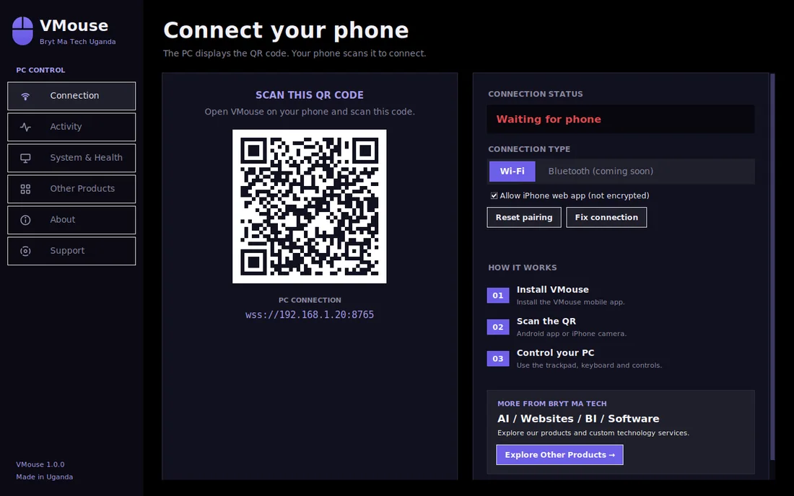
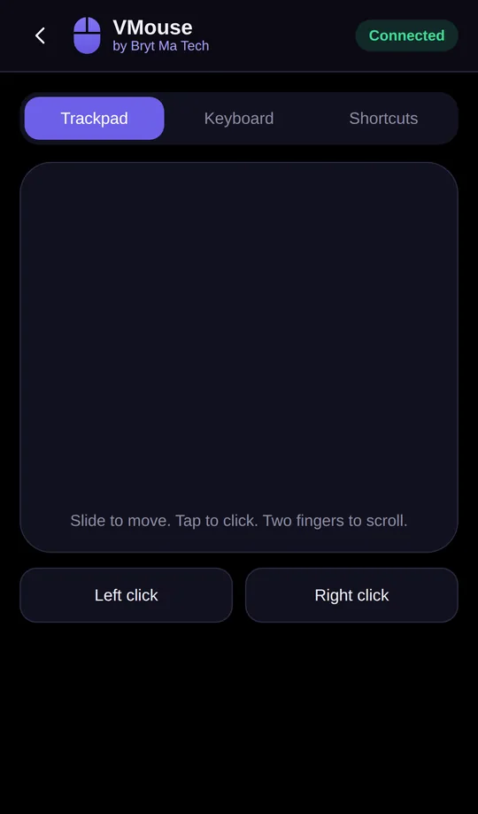
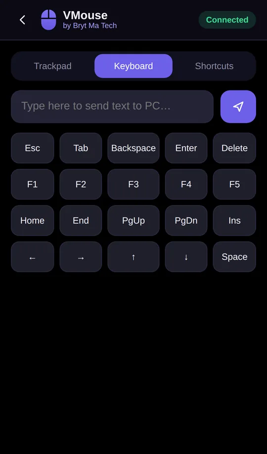
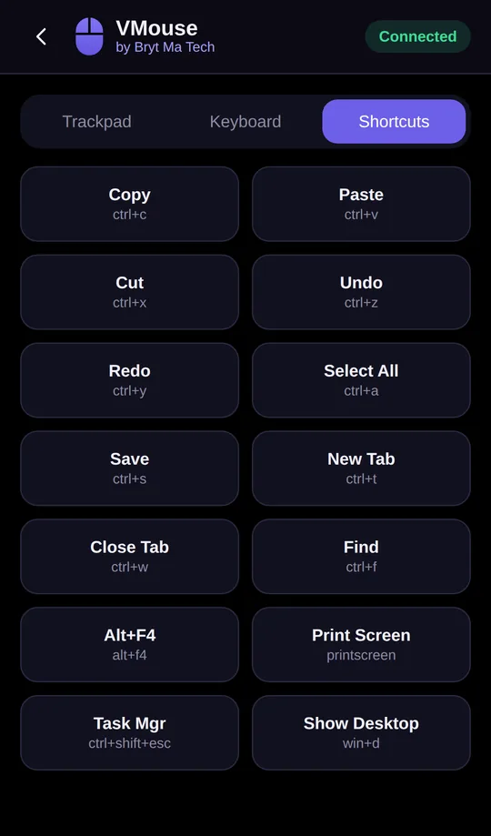
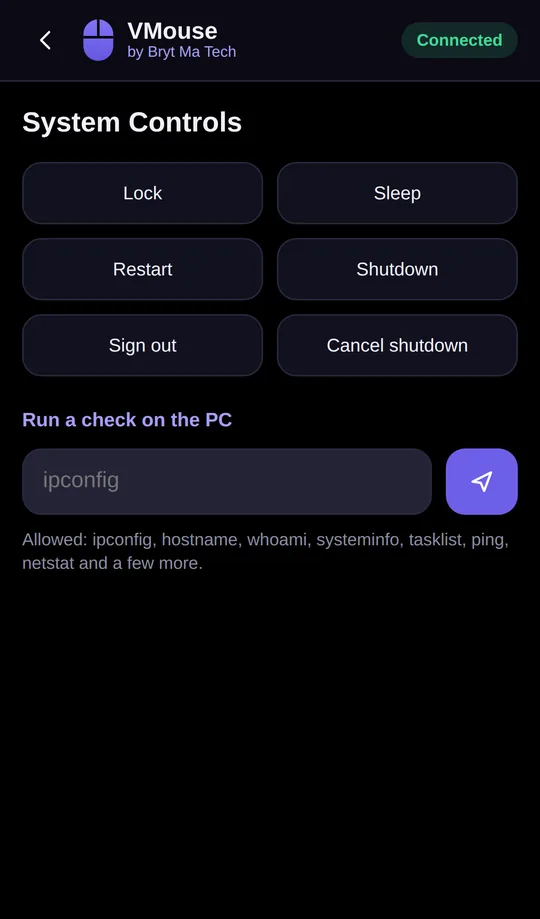

  

<h1 align="center">VMouse</h1>

  <b>Use your phone as a mouse, keyboard and remote for your computer.</b> 
  Windows, Mac, Linux, Android and iPhone. Built by Bryt Ma Tech Uganda.

  <a href="https://muhumuza684.github.io/vmouse/"><b>Download VMouse</b></a>
  &nbsp;|&nbsp;
  <a href="https://github.com/muhumuza684/vmouse/releases/latest">Latest release</a>
  &nbsp;|&nbsp;
  <a href="docs/poster/VMouse-poster-print.pdf">Poster</a>

  
  

  

## Download

Go to **<https://muhumuza684.github.io/vmouse/>** and pick your device, or take the files straight from the
[Releases page](https://github.com/muhumuza684/vmouse/releases/latest).

| For | File | State |
| --- | --- | --- |
| Windows PC | `VMouse-Setup.exe` (installer) or `VMouse-portable.exe` | Available |
| Android phone | `VMouse.apk` | Available |
| iPhone | no download, scan the QR code with the camera | Available |
| Mac | `VMouse-mac.zip` | Beta |
| Linux | `VMouse-linux.tar.gz` | Beta |

Bluetooth is planned. Today VMouse works over Wi-Fi.

## How it works

1. Install and open VMouse on your computer. It shows a QR code.
2. Android: open the VMouse app and scan the code. iPhone: scan it with the camera and tap the link.
3. Slide to move the mouse, tap to click, type, use shortcuts, control power and see your computer's health.

Your phone and computer must be on the same Wi-Fi network.
On Windows, if your phone cannot connect, press **Fix connection** in VMouse and choose Yes.

## Features

- Trackpad with click, right-click, scroll and drag
- Keyboard input, special keys and one-tap shortcuts
- Lock, sleep, restart and shut down, with a confirmation first
- Health monitor: processor, memory, disk and battery
- Same look on the PC app, the Android app and the iPhone web app

  
  
  
  

## Security

- Every connection needs the secret pairing code from the QR code. Press **Reset pairing** in VMouse to cut off every phone and make a new code.
- The Android app connects over TLS and checks your computer's certificate fingerprint.
- The iPhone web app cannot trust a home-made certificate, so it connects without encryption but still needs the pairing code. You can switch it off in VMouse.
- Wrong codes are blocked after five tries. Only a small allow-list of read-only commands can be run from the phone.
- The web server only serves the `pwa` folder, never the program files.

## Build from source

PC app (Python 3.10 or newer):

    pip install -r requirements.txt
    python vmouse_server.py        # run it
    python build_app.py            # build it for your system into dist/

Tests:

    pip install pytest
    python -m pytest tests

Android app (Flutter):

    flutter pub get
    flutter build apk --release

Releases are built by GitHub when a version tag is pushed. See [RELEASING.md](RELEASING.md).

## Project layout

| Path | What it is |
| --- | --- |
| `vmouse_server.py` | The PC app: window and servers |
| `ui/` | One file per window page (Connection, Activity, System, Products, About, Support) |
| `pairing.py` | Pairing code, certificate fingerprint, network address, Windows firewall helper |
| `web_static.py` | Locked-down web server for the iPhone web app |
| `pwa/` | The iPhone web app that the PC serves |
| `platform_utils.py`, `system_handler.py`, `health_handler.py` | Windows, Mac and Linux differences, power commands, health data |
| `ui_kit.py`, `tray.py` | Dark scrollbar and sidebar icons, system tray icon |
| `lib/`, `android/`, `pubspec.yaml` | The Android app (Flutter) |
| `assets/` | Icons and product images |
| `installer/` | Windows installer script (Inno Setup) |
| `build_app.py` | Builds the PC app for Windows, Mac or Linux |
| `tests/` | Automatic tests |
| `docs/` | The landing page and poster, published with GitHub Pages |
| `.github/workflows/build.yml` | Builds everything and publishes releases |

## Support

Use the **Support** page inside VMouse, or [open an issue](https://github.com/muhumuza684/vmouse/issues).

---

Made by **Bryt Ma Tech Uganda**.
